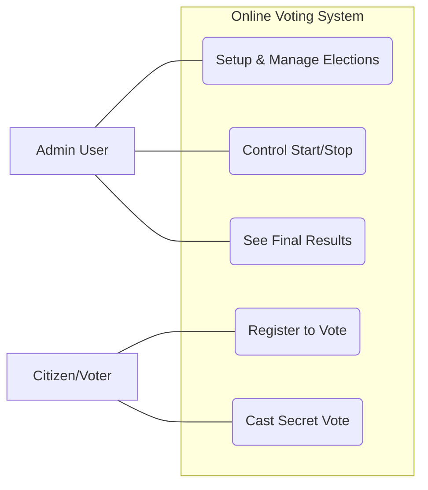
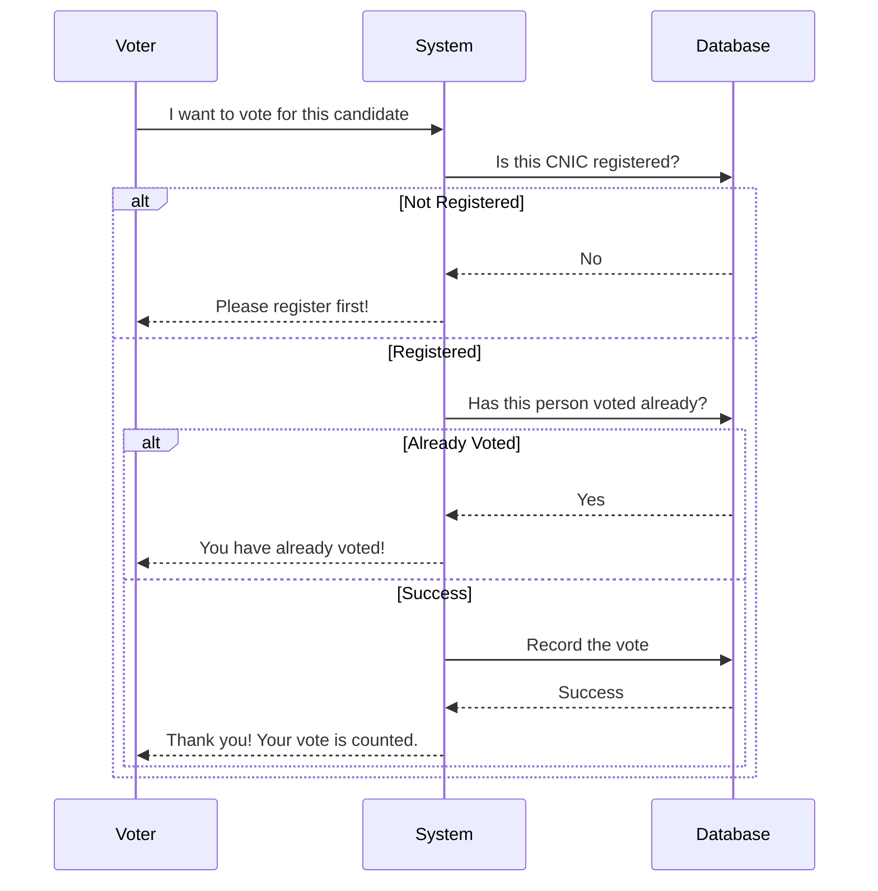
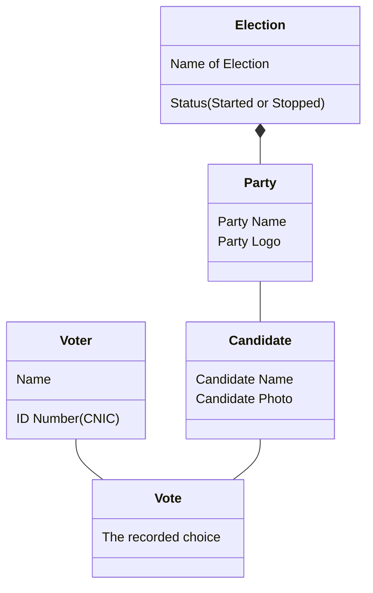
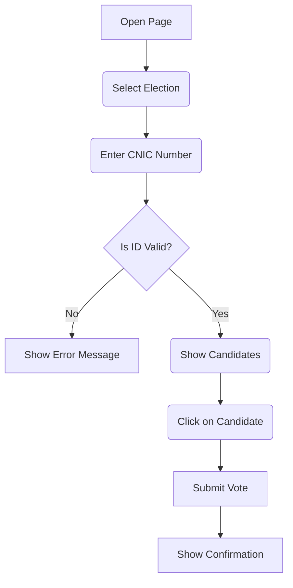
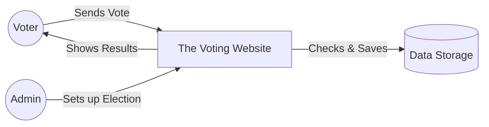
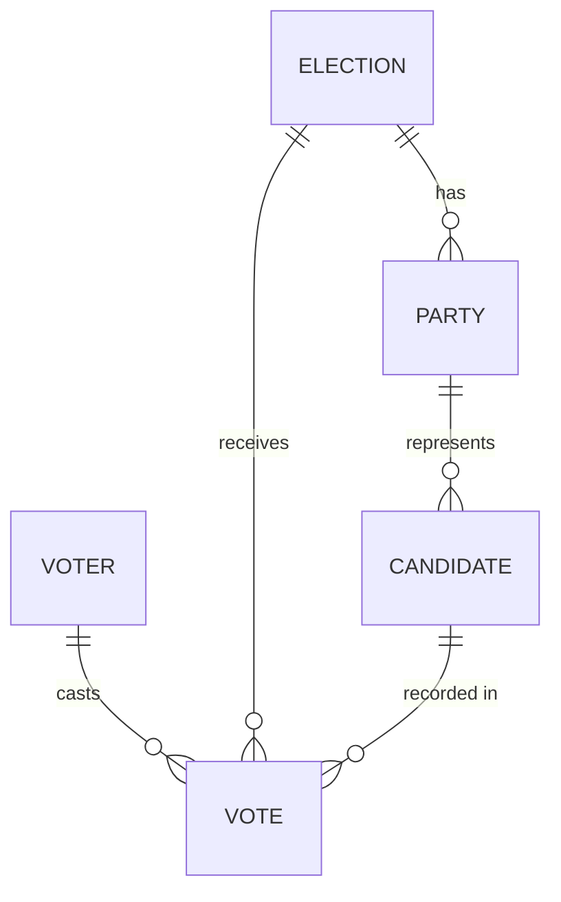

# Software Requirements Specification (SRS)
## Project: Online Voting System

---

## Table of Contents
1. [Introduction](#1-introduction)
2. [Overall Description](#2-overall-description)
3. [System Features](#3-system-features)
4. [Visual Diagrams (Simplified)](#4-visual-diagrams)
   - 4.1 Use Case Diagram (Who does what?)
   - 4.2 Flow Diagram (How a vote is cast)
   - 4.3 System Structure (How parts connect)
   - 4.4 Step-by-Step Activity
   - 4.5 Data Movement
   - 4.6 Relationship Map (Database)
5. [Data Dictionary](#5-data-dictionary)
6. [Security & Rules](#6-security--rules)
7. [Technical Stack](#7-technical-stack)

---

## 1. Introduction
This document explains how the **Online Voting System** works in simple terms. It acts as a guide for anyone who wants to understand the system's purpose, features, and design.

---

## 2. Overall Description
The Online Voting System is a website that allows people to vote from their computers or phones. It ensures that only registered people can vote and that no one can vote more than once.

- **For Voters**: A simple way to pick their favorite candidate.
- **For Admins**: A control panel to setup and manage the elections.

---

## 3. System Features
- **Election Setup**: Admins can create new elections and add names of parties and candidates.
- **Voter Security**: The system checks the CNIC number to make sure the person is allowed to vote.
- **Real-time Rules**: You can add candidates even while an election is happening, but you can't delete someone who already has votes.
- **Automatic Counting**: The system counts the votes automatically and shows the winner once the election ends.

---

## 4. Visual Diagrams

### 4.1 Use Case Diagram (Who does what?)
This diagram shows the main actions of the two types of people using the system.

### 4.2 Flow Diagram (How a vote is cast)
This shows the step-by-step logic when a voter submits their pick.

### 4.3 System Structure (How parts connect)
A simple view of how the different pieces of information are organized.

### 4.4 Step-by-Step Activity
What happens when you open the voting page.

### 4.5 Data Movement
How information flows from the user to the database.

### 4.6 Relationship Map (Database)
How the tables in the database are linked together.

---

## 5. Data Dictionary
A simple explanation of what we store:
- **Election**: The title of the event (e.g., "Local Election 2025").
- **Party**: The group or organization (e.g., "Justice Party").
- **Candidate**: The specific person running for office.
- **Voter**: The citizen, identified by their unique CNIC.
- **Vote**: A secure record linking a voter choice to a candidate.

---

## 6. Security & Rules
- **No Cheating**: The system checks the ID number immediately. If you've voted, you can't vote again.
- **Privacy**: No one can see who you voted for after you submit.
- **Safety**: The Admin cannot delete a candidate if people have already voted for them.

---

## 7. Technical Stack
- **Languages**: HTML/CSS/Javascript (The website look and feel).
- **Engine**: Node.js (The "brain" that processes votes).
- **Storage**: SQLite (The digital safe for all information).
